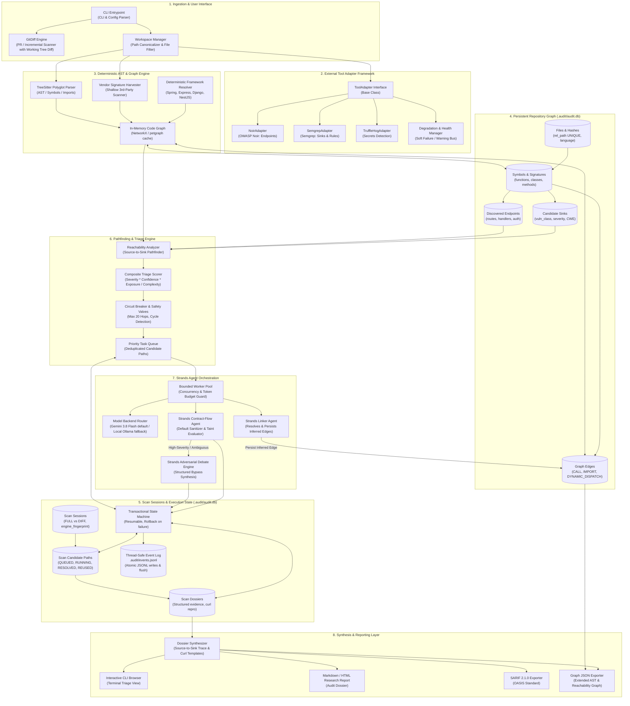

# System Specification: Polyglot Cross-File Source Code Security Reviewer

## 1. Executive Summary & Design Philosophy

This specification defines the architecture, data models, API signatures, edge-case matrices, and operational boundaries for an offensive-minded source code security review system. 

The primary objective is to empower security researchers to discover high-impact vulnerabilities (e.g., Remote Code Execution, SQL Injection, Authentication/Authorization Bypasses, SSRF, Path Traversal, and Hardcoded Secrets) through automated attack surface mapping, deterministic cross-file taint reachability, and agentic LLM reasoning.

### Core Principles
- **Orchestrate, Don't Reinvent:** Leverage established static scanners (OWASP Noir, Semgrep, TruffleHog) via pluggable adapters rather than re-implementing basic parsers.
- **Persistent Repository Graph (Decoupled from Scans):** The Code Property Graph (files, symbols, endpoints, sinks, edges) is stored persistently at the repository level. Scan sessions (`FULL` vs. `DIFF`) query, update, and reuse this graph incrementally rather than rebuilding it from scratch.
- **Strict Version Gating for Incremental Re-use:** An unaffected finding is only reusable if its `engine_fingerprint` (hash of tool versions, Semgrep rulesets, model ID, and scanner config) matches the current run.
- **Polyglot Hybrid Tiered Reachability:** Tree-sitter coarse symbol graphs and heuristic reachability filter out 95% of noise before involving LLMs.
- **Recall Over Speed:** Never discard plausible cross-file paths without evidence; attach provenance and confidence scores to every inferred graph edge.
- **Resilient & Resumable State:** Durable SQLite state store (`.audit/audit.db`) with an append-only, thread-safe event log (`.audit/events.jsonl`) guarantees that scans can pause, recover from failures, or be triaged incrementally.
- **Dual-Mode LLM Topology:** Cloud-first Gemini 3.8 Flash targeted multi-file slices by default, with an offline pluggable local LLM backend (Ollama/vLLM) via the Strands Agent SDK.

---

## 2. Strict Non-Goals (What We Explicitly Will NOT Build)

To prevent scope creep and maintain research focus, the following capabilities are **strictly out of scope**:

1. **No Active / Dynamic Attack Execution:**
   - The tool will **never** launch HTTP requests, inject payloads against live targets, or trigger dynamic exploits in running environments.
   - It outputs static curl/HTTP request templates for manual researcher verification, not automated exploit execution.
2. **No Weaponized Exploit Generation:**
   - The system produces security research dossiers with vulnerability theories and reproduction blueprints, but will **not** generate weaponized exploit binaries, memory-corruption shellcode, or offensive tooling intended for automated compromise.
3. **No Compliance & Linting Bloat:**
   - No generic style checking, code smell linters, or check-the-box compliance reports (e.g., "missing docstrings", "variable naming convention"). Only exploitable security weaknesses are flagged.
4. **No Monolithic Single-File Context Dumps:**
   - The system will **never** dump an entire 500k-line repository into an LLM prompt. Analysis is strictly decomposed into targeted reachability slices.
5. **No Deep Recursive Vendor Traversal:**
   - Third-party packages (`node_modules/`, `vendor/`, `site-packages/`) are subject to shallow signature harvesting only. The tool will not audit vendor libraries recursively unless explicitly requested for a targeted callsite.
6. **No Uncurated Chain-of-Thought / Raw Scratchpad Persistence:**
   - Internal model monologues, private deliberation tokens, and raw scratchpads are strictly ephemeral. Only curated, structured security evidence (`source_control_evidence`, `transform_sanitizer_evidence`, `sink_requirements`, `bypass_reasoning`) and public verdicts are persisted.
7. **No Proprietary Vendor Lock-in:**
   - No hardcoded reliance on a single LLM vendor; the model backend interface must remain decoupled.

---

## 3. Architecture & Dependency Topology



---

## 4. Complete State & Data Models

### 4.1 SQLite Relational Schema (`.audit/audit.db`)

```sql
PRAGMA foreign_keys = ON;
PRAGMA journal_mode = WAL;

-- ============================================================================
-- 1. PERSISTENT REPOSITORY GRAPH LAYER (Survives across scans)
-- ============================================================================

-- Repository files indexed
CREATE TABLE IF NOT EXISTS files (
    file_id INTEGER PRIMARY KEY AUTOINCREMENT,
    rel_path TEXT NOT NULL UNIQUE,
    language TEXT NOT NULL,
    is_vendor BOOLEAN DEFAULT 0,
    file_hash TEXT NOT NULL,
    loc INTEGER NOT NULL,
    last_indexed_commit TEXT,
    last_indexed_at TIMESTAMP DEFAULT CURRENT_TIMESTAMP
);
CREATE INDEX idx_files_path ON files(rel_path);
CREATE INDEX idx_files_hash ON files(file_hash);

-- Symbols (functions, methods, classes, interfaces)
CREATE TABLE IF NOT EXISTS symbols (
    symbol_id INTEGER PRIMARY KEY AUTOINCREMENT,
    file_id INTEGER NOT NULL REFERENCES files(file_id) ON DELETE CASCADE,
    name TEXT NOT NULL,
    kind TEXT CHECK(kind IN ('FUNCTION', 'METHOD', 'CLASS', 'INTERFACE', 'VARIABLE')) NOT NULL,
    start_line INTEGER NOT NULL,
    start_col INTEGER NOT NULL,
    end_line INTEGER NOT NULL,
    end_col INTEGER NOT NULL,
    signature TEXT,
    scope TEXT
);
CREATE INDEX idx_symbols_file ON symbols(file_id, name);
CREATE INDEX idx_symbols_name ON symbols(name);

-- Discovered Endpoints (OWASP Noir + Heuristic AST)
CREATE TABLE IF NOT EXISTS endpoints (
    endpoint_id INTEGER PRIMARY KEY AUTOINCREMENT,
    file_id INTEGER NOT NULL REFERENCES files(file_id) ON DELETE CASCADE,
    http_method TEXT NOT NULL,
    route_pattern TEXT NOT NULL,
    handler_symbol_id INTEGER REFERENCES symbols(symbol_id) ON DELETE SET NULL,
    line_number INTEGER NOT NULL,
    auth_required BOOLEAN DEFAULT 0,
    parameters_json TEXT, -- JSON array of {name, in, type, required}
    tool_provenance TEXT NOT NULL,
    UNIQUE(file_id, http_method, route_pattern, line_number)
);
CREATE INDEX idx_endpoints_route ON endpoints(http_method, route_pattern);

-- Discovered Candidate Sinks (Semgrep + Tree-sitter AST)
CREATE TABLE IF NOT EXISTS candidate_sinks (
    sink_id INTEGER PRIMARY KEY AUTOINCREMENT,
    file_id INTEGER NOT NULL REFERENCES files(file_id) ON DELETE CASCADE,
    symbol_id INTEGER REFERENCES symbols(symbol_id) ON DELETE SET NULL,
    vuln_class TEXT NOT NULL, -- e.g., 'RCE', 'SQLI', 'SSRF', 'PATH_TRAVERSAL'
    severity TEXT CHECK(severity IN ('CRITICAL', 'HIGH', 'MEDIUM', 'LOW', 'INFO')) NOT NULL,
    line_number INTEGER NOT NULL,
    cwe_id TEXT,
    sink_expression TEXT NOT NULL,
    raw_rule_id TEXT NOT NULL,
    tool_provenance TEXT NOT NULL,
    UNIQUE(file_id, line_number, raw_rule_id)
);
CREATE INDEX idx_sinks_class ON candidate_sinks(vuln_class);

-- Cross-File Graph Edges (Direct calls, imports, dynamic dispatches)
CREATE TABLE IF NOT EXISTS graph_edges (
    edge_id INTEGER PRIMARY KEY AUTOINCREMENT,
    caller_symbol_id INTEGER NOT NULL REFERENCES symbols(symbol_id) ON DELETE CASCADE,
    callee_symbol_id INTEGER NOT NULL REFERENCES symbols(symbol_id) ON DELETE CASCADE,
    edge_type TEXT CHECK(edge_type IN ('CALL', 'IMPORT', 'INHERITS', 'DYNAMIC_DISPATCH', 'EVENT_EMIT')) NOT NULL,
    provenance TEXT CHECK(provenance IN ('DETERMINISTIC', 'AGENT_INFERRED', 'HEURISTIC_CANDIDATE')) NOT NULL,
    confidence REAL CHECK(confidence >= 0.0 AND confidence <= 1.0) NOT NULL,
    metadata_json TEXT,
    UNIQUE(caller_symbol_id, callee_symbol_id, edge_type)
);
CREATE INDEX idx_edges_traversal ON graph_edges(caller_symbol_id, callee_symbol_id);

-- Vendor Signatures (Shallow 3rd-party library sink mappings)
CREATE TABLE IF NOT EXISTS vendor_signatures (
    sig_id INTEGER PRIMARY KEY AUTOINCREMENT,
    package_name TEXT NOT NULL,
    api_name TEXT NOT NULL,
    potential_sink_class TEXT NOT NULL,
    signature_pattern TEXT,
    UNIQUE(package_name, api_name)
);

-- ============================================================================
-- 2. SCAN SESSIONS & FINDINGS LAYER (Scoped to individual scan executions)
-- ============================================================================

-- Metadata tracking individual scan executions (FULL or DIFF)
CREATE TABLE IF NOT EXISTS scans (
    scan_id TEXT PRIMARY KEY,
    target_path TEXT NOT NULL,
    scan_mode TEXT CHECK(scan_mode IN ('FULL', 'DIFF')) NOT NULL,
    base_commit TEXT,
    target_commit TEXT,
    engine_fingerprint TEXT NOT NULL, -- SHA256(tools + rules + model + config)
    status TEXT CHECK(status IN ('INITIALIZING', 'INDEXING', 'TRIAGING', 'VERIFYING', 'COMPLETED', 'FAILED', 'ABORTED')) NOT NULL,
    started_at TIMESTAMP DEFAULT CURRENT_TIMESTAMP,
    completed_at TIMESTAMP,
    config_json TEXT NOT NULL,
    stats_json TEXT
);
CREATE INDEX idx_scans_status ON scans(status);

-- Candidate Reachability Paths evaluated in a specific scan
CREATE TABLE IF NOT EXISTS scan_candidate_paths (
    path_id TEXT PRIMARY KEY, -- SHA256 of scan_id + endpoint_id + sink_id + call_sequence
    scan_id TEXT NOT NULL REFERENCES scans(scan_id) ON DELETE CASCADE,
    endpoint_id INTEGER NOT NULL REFERENCES endpoints(endpoint_id) ON DELETE CASCADE,
    sink_id INTEGER NOT NULL REFERENCES candidate_sinks(sink_id) ON DELETE CASCADE,
    hop_count INTEGER NOT NULL,
    call_sequence_json TEXT NOT NULL, -- Array of symbol_ids and edge_ids
    priority_score REAL NOT NULL,
    state TEXT CHECK(state IN (
        'QUEUED', 'RUNNING', 'RESOLVED', 'UNRESOLVED',
        'PATH_PRUNED_DEPTH_LIMIT', 'PATH_PRUNED_BUDGET',
        'PATH_FAILED_TIMEOUT', 'PATH_FAILED_API', 'PATH_FAILED_AGENT',
        'REUSED_FROM_CACHE'
    )) NOT NULL DEFAULT 'QUEUED',
    retry_count INTEGER DEFAULT 0,
    created_at TIMESTAMP DEFAULT CURRENT_TIMESTAMP,
    updated_at TIMESTAMP DEFAULT CURRENT_TIMESTAMP
);
CREATE INDEX idx_paths_triage ON scan_candidate_paths(scan_id, state, priority_score DESC);

-- Verified Vulnerability Dossiers produced in a scan
CREATE TABLE IF NOT EXISTS scan_dossiers (
    dossier_id TEXT PRIMARY KEY,
    scan_id TEXT NOT NULL REFERENCES scans(scan_id) ON DELETE CASCADE,
    path_id TEXT REFERENCES scan_candidate_paths(path_id) ON DELETE SET NULL,
    engine_fingerprint TEXT NOT NULL, -- Matched against scan for reuse validity
    title TEXT NOT NULL,
    vuln_class TEXT NOT NULL,
    severity TEXT CHECK(severity IN ('CRITICAL', 'HIGH', 'MEDIUM', 'LOW')) NOT NULL,
    cwe_id TEXT NOT NULL,
    verdict TEXT CHECK(verdict IN (
        'EXPLOITABLE', 
        'LIKELY_EXPLOITABLE_PARTIAL_SANITIZATION', 
        'SAFE_PROVEN', 
        'INSUFFICIENT_CONTEXT'
    )) NOT NULL,
    confidence REAL NOT NULL,
    source_trace_json TEXT NOT NULL,
    sanitizer_analysis_json TEXT NOT NULL, -- Curated structured evidence ONLY (no private CoT)
    repro_curl_template TEXT,
    mitigation_notes TEXT,
    created_at TIMESTAMP DEFAULT CURRENT_TIMESTAMP
);
CREATE INDEX idx_dossiers_verdict ON scan_dossiers(scan_id, verdict, severity);
```

### 4.2 Append-Only Event Log Schema (`.audit/events.jsonl`)

The event log is strictly append-only, thread-safe, and protected against inter-thread line interleaving via a process-level write lock. Critical events (`PATH_TRANSITION`, `DOSSIER_SYNTHESIZED`, `CIRCUIT_BREAKER_TRIGGERED`) trigger an immediate OS flush (`flush()` / `os.fdatasync()`):

```typescript
export interface EventRecord {
  event_id: string;             // UUIDv4
  timestamp: string;            // ISO-8601 UTC
  scan_id: string;              // Target scan ID
  component: 'TOOL_ADAPTER' | 'AST_INDEXER' | 'REACHABILITY' | 'STRANDS_AGENT' | 'SYSTEM';
  event_type: 
    | 'TOOL_STARTED' | 'TOOL_FINISHED' | 'TOOL_FAILED' | 'TOOL_UNAVAILABLE'
    | 'GRAPH_NODE_UPDATED' | 'GRAPH_EDGE_INFERRED'
    | 'DIFF_IMPACT_PROPAGATED'
    | 'PATH_QUEUED' | 'PATH_TRANSITION' | 'CIRCUIT_BREAKER_TRIGGERED'
    | 'AGENT_DISPATCHED' | 'AGENT_STEP' | 'AGENT_DEBATE_ROUND'
    | 'DOSSIER_SYNTHESIZED';
  payload: Record<string, unknown>;
}
```

---

## 5. API Signatures & Interfaces

### 5.1 Pluggable Tool Adapter Interface

```python
from abc import ABC, abstractmethod
from dataclasses import dataclass
from typing import List, Dict, Any, Optional
from pathlib import Path

@dataclass
class ToolExecutionResult:
    tool_name: str
    is_available: bool
    exit_code: int
    duration_sec: float
    raw_stdout: str
    raw_stderr: str
    normalized_items: List[Dict[str, Any]]
    warnings: List[str]

class ToolAdapter(ABC):
    """Abstract base class for all external security tools."""

    @property
    @abstractmethod
    def name(self) -> str:
        """Name of the tool (e.g., 'noir', 'semgrep', 'trufflehog')."""
        pass

    @abstractmethod
    def is_installed(self) -> bool:
        """Check if binary is available in host PATH or container."""
        pass

    @abstractmethod
    def run(self, repo_path: Path, options: Dict[str, Any]) -> ToolExecutionResult:
        """Execute the tool and return normalized findings."""
        pass

    @abstractmethod
    def normalize(self, raw_output: str) -> List[Dict[str, Any]]:
        """Transform raw tool output into canonical JSON events."""
        pass
```

### 5.2 Tree-sitter Polyglot Indexer & Code Property Graph

```python
from typing import List, Optional, Tuple, Set, Dict, Any
import networkx as nx

@dataclass
class ASTSymbol:
    name: str
    kind: str
    file_path: str
    start_line: int
    end_line: int
    signature: Optional[str]
    scope: str

@dataclass
class GraphEdge:
    source_symbol: str
    target_symbol: str
    edge_type: str
    provenance: str  # 'DETERMINISTIC' | 'AGENT_INFERRED' | 'HEURISTIC_CANDIDATE'
    confidence: float
    callsite_line: int

class CodePropertyGraph:
    """Manages the persistent repository-level graph in SQLite and in-memory cache."""
    def __init__(self, db_path: str):
        self.db_path = db_path
        self._graph: nx.DiGraph = nx.DiGraph()

    def sync_from_db(self) -> None:
        """Loads persistent repository graph from SQLite into memory."""
        pass

    def update_file_symbols(self, file_id: int, symbols: List[ASTSymbol], edges: List[GraphEdge]) -> None:
        """Updates symbols and edges for a specific file, pruning stale nodes."""
        pass

    def find_reachable_paths(
        self, 
        endpoint_id: int, 
        sink_id: int, 
        max_hops: int = 20
    ) -> List[List[GraphEdge]]:
        """Traverses in-memory graph to find paths, pruning cycles."""
        pass
```

### 5.3 Incremental Git-Diff & Impact Propagation Engine (with Working-Tree & Version Gating)

```python
@dataclass
class DiffImpactPlan:
    changed_files: List[Path]
    modified_symbol_ids: Set[int]
    affected_endpoint_ids: Set[int]
    affected_sink_ids: Set[int]
    reusable_dossier_ids: Set[str]

class GitDiffEngine:
    def __init__(self, repo_path: Path, db_manager):
        self.repo_path = repo_path
        self.db = db_manager

    def compute_engine_fingerprint(self, config: Dict[str, Any]) -> str:
        """Generates SHA256 over tool versions, semgrep rulesets, model ID, and scanner config."""
        pass

    def compute_impact(self, base_ref: str, current_config: Dict[str, Any]) -> DiffImpactPlan:
        """
        1. Compares working tree + index + uncommitted changes against base_ref:
           - Executes `git diff --name-only <base_ref>`
           - Plus `git ls-files --others --exclude-standard` for untracked additions.
        2. Detects modified, added, and deleted files.
        3. Traverses existing persistent graph to identify affected upstream endpoints
           and downstream sinks.
        4. Version Gating: Verifies if current engine_fingerprint matches previous scan.
           If fingerprint differs (tool/rules/model updated), invalidates cache and marks
           all candidate paths for fresh evaluation.
        """
        pass
```

### 5.4 Priority & Triage Scorer

```python
class CompositeScorer:
    SEVERITY_WEIGHTS = {
        'CRITICAL': 1.0,
        'HIGH': 0.8,
        'MEDIUM': 0.5,
        'LOW': 0.2,
        'INFO': 0.05
    }

    @staticmethod
    def calculate_priority(
        sink_severity: str,
        reachability_confidence: float,
        is_unauthenticated: bool,
        hop_count: int
    ) -> float:
        """
        Priority = (Sink Severity * Reachability Confidence * Exposure Level) / Path Complexity
        """
        sev_weight = CompositeScorer.SEVERITY_WEIGHTS.get(sink_severity, 0.1)
        exposure_multiplier = 1.5 if is_unauthenticated else 1.0
        complexity_penalty = max(1.0, float(hop_count) ** 0.5)
        
        return (sev_weight * reachability_confidence * exposure_multiplier) / complexity_penalty
```

### 5.5 Strands Agent Orchestrator & Taint Verdict Engine

```python
from enum import Enum

class VerdictStatus(Enum):
    EXPLOITABLE = "EXPLOITABLE"
    LIKELY_EXPLOITABLE_PARTIAL_SANITIZATION = "LIKELY_EXPLOITABLE_PARTIAL_SANITIZATION"
    SAFE_PROVEN = "SAFE_PROVEN"
    INSUFFICIENT_CONTEXT = "INSUFFICIENT_CONTEXT"

@dataclass
class TaintVerdict:
    verdict: VerdictStatus
    confidence: float
    source_control_evidence: str
    transform_sanitizer_evidence: str
    sink_requirements: str
    bypass_reasoning: str
    suggested_curl: Optional[str]

class StrandsVerificationOrchestrator:
    def __init__(self, backend_router, circuit_breaker, max_workers: int = 4):
        self.backend = backend_router
        self.breaker = circuit_breaker
        self.max_workers = max_workers

    def evaluate_path(self, scan_id: str, path_id: str, context_slice: Dict[str, Any]) -> TaintVerdict:
        """
        1. Run ContractFlowAgent (Single Agent Contract Evaluation).
        2. If critical sink or ambiguous partial sanitization:
           Escalate to AdversarialDebateEngine (Prosecutor vs. Defender).
        3. Persist only structured evidence and synthesized verdict into scan_dossiers.
           Raw internal debate transcripts / private chain-of-thought are strictly excluded.
        """
        pass
```

### 5.6 Complete Output & Reporting Suite (Markdown, SARIF 2.1.0, and Graph JSON)

```python
class GraphJSONExporter:
    """Exports persistent AST symbol graph, reachable taint paths, and endpoints."""
    def export(self, db_manager) -> Dict[str, Any]:
        """
        Returns JSON structure:
        {
          "metadata": { "repo": ..., "scan_id": ... },
          "nodes": [ { "id": ..., "name": ..., "kind": ..., "file": ... } ],
          "edges": [ { "caller": ..., "callee": ..., "type": ..., "provenance": ..., "confidence": ... } ],
          "endpoints": [ ... ],
          "sinks": [ ... ]
        }
        """
        pass
```

---

## 6. Exhaustive Matrix of Scenarios

### 6.1 Happy Path Scenarios

| Scenario ID | Preconditions | Trigger / Input | Expected System Behavior | Post-Condition State |
| :--- | :--- | :--- | :--- | :--- |
| **HP-01** | Clean git checkout of multi-tier Node/Express + Postgres app. Tools in `$PATH`. | Full repo scan: `review scan .` | 1. Workspace canonicalizes paths.<br/>2. Noir discovers 15 endpoints.<br/>3. Semgrep finds 4 candidate SQL sinks.<br/>4. Tree-sitter builds persistent symbol/import graph.<br/>5. Reachability traces 2 direct paths.<br/>6. Contract agent verifies 1 unsanitized path reaches `db.query`.<br/>7. Dossier synthesized with curl template. | `scans.status = 'COMPLETED'`. Persistent graph populated. 1 `EXPLOITABLE` dossier in `scan_dossiers`, Markdown, SARIF, and Graph JSON generated. |
| **HP-02** | Prior scan exists in `.audit/audit.db`. PR modifies 2 files in working tree. | Incremental scan: `review scan --diff origin/main` | 1. Git diff detects working tree changes against `origin/main` + untracked files.<br/>2. Engine fingerprint verified (matches previous scan).<br/>3. Updates only modified files in `files`, `symbols`, and `graph_edges`.<br/>4. Re-evaluates only paths passing through impacted symbols.<br/>5. Unchanged paths reused with `REUSED_FROM_CACHE`. | Scan completes in <5s. Persistent graph updated in place; `scan_dossiers` preserves valid findings. |
| **HP-03** | Prior scan exists, but user updated Semgrep rules / changed model ID. | Incremental scan: `review scan --diff origin/main` | 1. Engine fingerprint mismatch detected.<br/>2. Re-evaluates candidate paths despite unchanged source code.<br/>3. Logs `CACHE_INVALIDATED_ENGINE_VERSION_CHANGED` event. | Ensures findings always match active security policies and tool definitions. |
| **HP-04** | Monorepo with `node_modules` (150k files) and `vendor/` (50k files). | Full scan launched. | 1. Workspace filters vendor directories from full AST traversal.<br/>2. Vendor Signature Harvester extracts exported signatures into `vendor_signatures`.<br/>3. Memory remains bounded under 500MB. | No OOM failure; vendor sinks identified without AST explosion. |
| **HP-05** | Candidate path hits critical RCE sink (`child_process.exec`) with custom regex filter. | Reachability path triage priority > 0.85. | 1. Contract agent evaluates regex; flags potential anchor omission.<br/>2. Escalates to Adversarial Debate.<br/>3. Prosecutor constructs newline bypass theory (`\n id`); Defender concedes lack of `/m` multiline flag.<br/>4. Promoted to `EXPLOITABLE`. Curated evidence persisted (raw private monologue discarded). | Dossier records structured bypass rationale and curl repro. |

### 6.2 Input Validation Errors

| Scenario ID | Edge Condition / Fault | Trigger / Input | Expected System Behavior | Error Handling & State Transition |
| :--- | :--- | :--- | :--- | :--- |
| **IV-01** | Corrupted / malformed source file with severe syntax errors. | Broken `.py` file missing colons/indents. | 1. Tree-sitter returns `ERROR` nodes in CST.<br/>2. Parser extracts valid enclosing functions gracefully.<br/>3. Logs warning event: `PARSER_SYNTAX_DEGRADATION`. | File marked with partial symbols; scan continues without halting. |
| **IV-02** | Binary or minified file with misleading extension (e.g. 10MB bundled `.js` or compiled `.so` named `.c`). | Repo includes minified bundle `app.min.js`. | 1. Workspace file filter checks MIME / binary null bytes and average line length (>1000 chars).<br/>2. Excludes file from AST indexing.<br/>3. Emits `FILE_SKIPPED_MINIFIED` event. | File skipped; DB records `loc = 0`, scan proceeds. |
| **IV-03** | Recursive symlink loops (e.g., `dirA/link -> dirA`). | Repository with circular filesystem links. | 1. Path canonicalizer tracks visited device/inode sets.<br/>2. Detects cycle before descending.<br/>3. Emits `SYMLINK_CYCLE_IGNORED`. | Zero stack-overflow or filesystem recursion errors. |
| **IV-04** | Filenames with path traversal or control characters (`../../etc/passwd`, `\x00`). | Adversarial repo designed to exploit scanners. | 1. Path normalizer rejects relative escape prefixes.<br/>2. Sanitizes filenames against base root strictly.<br/>3. Raises `SECURITY_PATH_ESCAPE_BLOCKED`. | Attack blocked; offending path logged safely in `.audit/audit.db`. |
| **IV-05** | Non-UTF8 encodings (Shift-JIS, ISO-8859-1, UTF-16LE without BOM). | Mixed encoding legacy codebase. | 1. Ingestion reader attempts UTF-8 with fallback to `chardet`/`charset-normalizer`.<br/>2. Strips invalid surrogate pairs before SQLite insert. | Database inserts succeed cleanly without encoding crashes. |

### 6.3 Network & Async Timeouts (LLM & Tools)

| Scenario ID | Fault Injection | Trigger / Input | Expected System Behavior | Error Handling & State Transition |
| :--- | :--- | :--- | :--- | :--- |
| **NT-01** | Gemini API returns HTTP 429 (Rate Limit Exceeded). | High-concurrency agent verification. | 1. HTTP client catches 429.<br/>2. Inspects `Retry-After` header or initiates exponential backoff with jitter (1s, 2s, 4s, 8s, max 32s).<br/>3. Up to 3 retries. | If exhausted, marks path as `PATH_FAILED_API`; transaction rolled back; path retried in next pass. |
| **NT-02** | Gemini API returns HTTP 503 (Service Unavailable) or drops connection mid-stream. | Network partition during agent reasoning. | 1. Stream timeout triggers after 45s of silence.<br/>2. Closes dangling socket.<br/>3. Rolls back current path transaction. | Path state set to `PATH_FAILED_TIMEOUT`. Does not corrupt DB. |
| **NT-03** | Local Ollama / vLLM endpoint hangs / OOMs. | Fallback local agent mode enabled. | 1. Client enforces 60s hard timeout on local inference calls.<br/>2. Kills hanging request.<br/>3. Flags local backend as degraded; notifies user CLI. | Path marked `PATH_FAILED_AGENT`. Circuit breaker halts further local requests. |
| **NT-04** | External tool binary (e.g. Semgrep) deadlocks or hangs on regex catastrophic backtracking. | `semgrep.run(repo)` hangs. | 1. Subprocess wrapper executes with `timeout=180`.<br/>2. Sends `SIGTERM`, waits 5s, sends `SIGKILL`.<br/>3. Emits `TOOL_FAILED` event. | Pipeline continues with Tree-sitter heuristics; scan does not stall indefinitely. |
| **NT-05** | Global token budget ceiling reached (e.g. $10 or 5,000,000 tokens limit set by user). | Long scan on large repository. | 1. Token counter hits `MAX_TOKEN_BUDGET`.<br/>2. Circuit breaker trips globally.<br/>3. Remaining queued paths transition to `PATH_PRUNED_BUDGET`. | Scan completes gracefully; report explicitly flags unanalyzed paths due to budget. |

### 6.4 Boundary Values & Scalability Limits

| Scenario ID | Boundary Dimension | Extreme Value | Expected System Behavior | System Guard / Invariant |
| :--- | :--- | :--- | :--- | :--- |
| **BV-01** | Endpoint Count | 0 endpoints detected (pure background daemon or CLI app). | 1. Noir returns empty set.<br/>2. Tool adapts to "CLI/Daemon" mode.<br/>3. Treats public exported functions / `main` functions as sources. | Analysis completes without divide-by-zero or empty-set crashes. |
| **BV-02** | Candidate Sinks | 25,000+ candidate sinks in 1M LOC repo. | 1. Semgrep dumps massive SARIF.<br/>2. Database batches inserts in chunks of 1,000 within a transaction.<br/>3. Composite Scorer filters bottom 80% low-confidence sinks from agent queue. | SQLite insert finishes in <2s; worker queue capped to top N paths. |
| **BV-03** | Graph Hop Depth | Deeply nested call chain (>30 functions deep). | 1. Reachability traversal reaches hop 20.<br/>2. Circuit breaker cuts traversal.<br/>3. Marks candidate path as `PATH_PRUNED_DEPTH_LIMIT`. | Prevents combinatorial explosion and graph search infinite loops. |
| **BV-04** | Agent Conversation Turns | Agent stuck in reasoning loop trying to verify interface. | Agent reaches 8 turns on a single path without reaching a verdict. | Circuit breaker terminates agent; sets verdict to `INSUFFICIENT_CONTEXT` with notes. |
| **BV-05** | File Size | 0-byte empty file vs 50MB single-line JSON/CSV file. | 0-byte file indexed; 50MB file filtered by size limit (>2MB default). | Zero division avoided on 0-byte; memory protected on 50MB file. |

### 6.5 Concurrency & State Contention

| Scenario ID | Concurrency Collision | Trigger / Input | Expected System Behavior | Invariant Guarantee |
| :--- | :--- | :--- | :--- | :--- |
| **CC-01** | Multiple worker threads writing to SQLite simultaneously. | 8 concurrent Strands agents completing paths. | 1. Database connection pool uses WAL mode and `busy_timeout = 5000ms`.<br/>2. Writes are short, scoped transactions. | Zero `SQLITE_BUSY` crashes; serialized write queues handled by SQLite engine. |
| **CC-02** | Two Linker Agents inferring the same broken edge at the same time. | Parallel paths traversing identical interface `IAuth.verify`. | 1. Edge insertion uses `INSERT OR IGNORE` on `(caller_symbol_id, callee_symbol_id, edge_type)`.<br/>2. Highest confidence score preserved. | Graph remains strictly consistent; no duplicate edge records. |
| **CC-03** | Concurrent workers appending to `.audit/events.jsonl`. | 8 parallel workers logging tool and agent events simultaneously. | 1. Worker threads acquire threading `Lock` around file append.<br/>2. Critical events trigger immediate `flush()`. | Zero byte interleaving or corrupted JSONL records. |
| **CC-04** | User hits `Ctrl+C` (SIGINT) mid-scan while agents are active. | User interrupts long-running review. | 1. Signal handler catches SIGINT.<br/>2. Cancels active thread pool gracefully.<br/>3. Reverts in-flight `RUNNING` paths to `QUEUED`.<br/>4. Commits `scans.status = 'ABORTED'`. | Database remains uncorrupted; running `review resume` continues cleanly. |
| **CC-05** | Candidate path deduplication race condition. | Multiple routes converging on the exact same helper and sink. | 1. Path ID is generated via deterministic SHA256 of `(scan_id, endpoint_id, sink_id, call_sequence)`.<br/>2. Deduplication queue rejects duplicate keys. | LLM is never invoked twice for identical source-to-sink traces. |

---

## 7. Spec Self-Review Checklist

- [x] **Placeholder Scan:** Zero "TBD", "TODO", or unstated types. Every table, column, method signature, and status enum is fully articulated.
- [x] **Internal Consistency:** Persistent repository graph tables (`files`, `symbols`, `endpoints`, `candidate_sinks`, `graph_edges`) are completely separated from scan-scoped execution tables (`scans`, `scan_candidate_paths`, `scan_dossiers`).
- [x] **Version Gating:** `engine_fingerprint` explicitly defined and required for incremental finding reuse.
- [x] **Scope Check:** Strict non-goals isolate this tool to static attack surface review, reachability, and research dossier synthesis. No private chain-of-thought persistence, no exploit execution or dynamic fuzzing.
- [x] **Ambiguity Check:** Explicit formulas provided for Composite Scoring; exact numbers specified for circuit breakers (20 hops, 8 turns, 2 Linkers/edge, 45s timeout).
